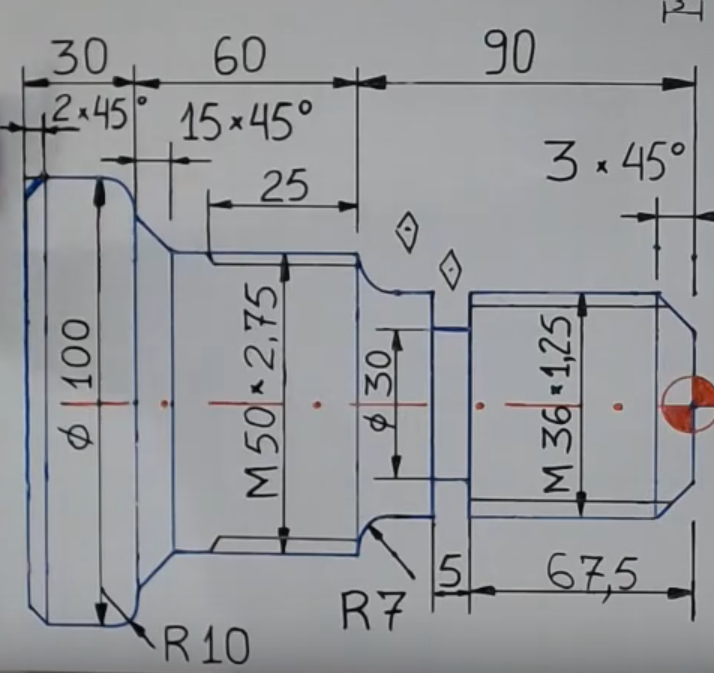

# 🛠️ Projeto CNC – Peça com Roscas M50 e M36

**Autor:** Leonardo N. Duarte  
📧 nevesduartel@gmail.com 

---

## 🎯 Objetivo

Demonstrar conhecimento técnico e domínio prático da **programação de tornos CNC com código G**, baseado em desenho técnico da peça com roscas métricas. O projeto envolve:

- Interpretação de desenho técnico
- Desenvolvimento de programa CNC completo (estilo FANUC)
- Etapas de desbaste, acabamento, canal e rosqueamento

---

## 🧩 Especificações da Peça




- **Comprimento total:** 255 mm  
- **Diâmetros principais:**
  - Ø100 mm na flange
  - Ø50 mm na rosca M50×2.75
  - Ø36 mm na rosca M36×1.25
  - Ø30 mm intermediário

- **Raios e chanfrados:**
  - R10 e R7 nas transições
  - Chanfrados: 2×45°, 15×45°, 3×45°

- **Roscas externas:**
  - M50×2.75 (prof. 25 mm)
  - M36×1.25 (prof. 67.5 mm)

---

## 🧱 Material Usinado

- **Aço Carbono 1045**
  - Resistência: ~570 MPa
  - Boa usinabilidade com metal duro
  - Ideal para componentes com carga média

---

## ⚙️ Processo de Usinagem

Utilização de **torno CNC com comando FANUC** em 5 etapas principais:

1. **Desbaste (T0101)**  
   Comando G71 com parâmetros P/Q/U/R para contorno automático  
2. **Acabamento (T0303)**  
   Feed fino com G70 para acabamento superficial de qualidade  
3. **Canal (T0505)**  
   Bedame de 3 mm, ciclos de corte com pausa (G4 P2000)  
4. **Rosqueamento (T0707)**  
   Ciclo G76 com roscas M36 e M50  
5. **Sangramento Final**  
   Contorno final com múltiplas passagens e feeds variados

---

## 🔤 Exemplo de Código G (trecho)

```gcode
G21 G40 G54
G28 U0 W0 
T0101
G50 S2200
M3
G96 S200
G0 X105 Z5
M8
G1 X102 Z0 F0.2
G1 X-1.5
...
``

---
O código G completo utilizado neste projeto está disponível neste repositório. Acesse o arquivo [programa-completo.gcode](programa-completo.gcode) para mais detalhes.
